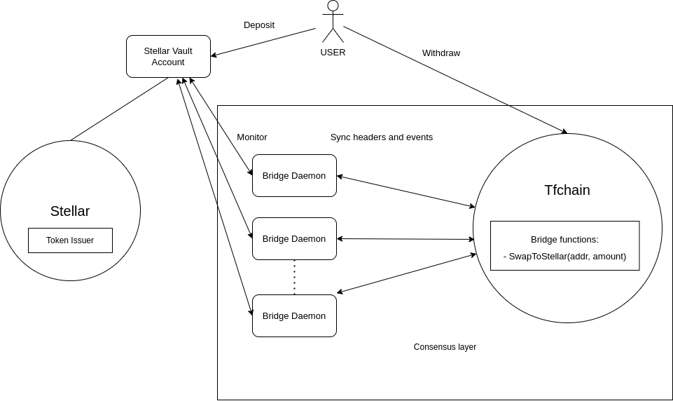

## Architecture

The principle used here is a "vaulting" mechanism. In practice, when using this bridge, tokens are vaulted on Stellar and minted / destroyed on tfchain.

### Stellar side

In order to set up this bridge, a Stellar keypair must be created that will "vault" all the stellar tokens. A choice can be made here, either this keypair is a single signature account or a multisignature account.

In production, we highly suggest a multisignature account is used for this bridge.

See [stellar-multisig](https://developers.stellar.org/docs/encyclopedia/signatures-multisig) to read more about the concept.

### Tfchain side

On tfchain side, tokens are minted / burned based on what is vaulted on the Stellar side.
Tokens cannot be created out of thin air, rather they are created by depositing on the vault account or destroyed when withdrawn from the vault account.

## Consensus

Since Stellar and Tfchain are 2 seperate blockchains, we needed a service that can communicate with both networks. The `tfchain_bridge` daemon is responsible for:

- Watching the Stellar vault account for incoming transactions and minting accordingly on Tfchain.
- Watching the Tfchain blockchain for interaction with the bridge functionality on chain to withdraw tokens from the vault back to the user's account on Stellar.

To reach an agreement to mint on Tfchain, the majority of bridge daemons in the network should report that a deposit happened. Only authorized bridge daemons can report the execution of stellar transactions on tfchain.

On the Stellar side, to reach an agreement to withdraw tokens from the vault, the majority of bridge daemons in the network should have posted a signature of the withdraw transaction that executes the withdrawal of tokens back to the user's account. We implemented this consensus layer on Tfchain itself, by querying the runtime storage, bridge daemons can reach agreement over the validity of a transaction.

Executed mints/withdraws are recorded on tfchain and cannot be replayed.

The bridge is compromised the moment the majority of bridge keys are stolen.

See diagram:

