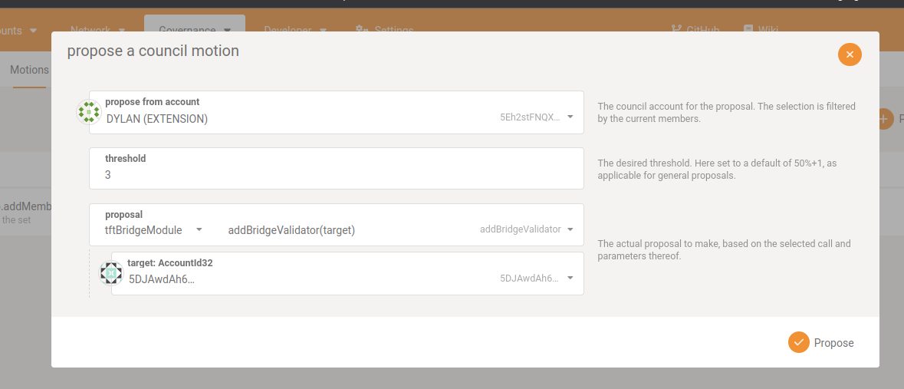

# Production setup

## Prerequisites

- Stellar account that has multisig enabled with a threshold of at least 2.
- As many tfchain accounts as the number of signers on the Stellar account.
- A running tfchain instance with the bridge pallet included.

## Setup

### Stellar

Generate a new keypair for the "master" bridge account. This account will be used to vault all the tokens on the Stellar side. This account will be a multisig account so you need to set the threshold to the number of signers you want to use.

There are 2 ways to do this:

- Manually using the [js-sdk](https://github.com/threefoldtech/js-sdk)
- Using any other official Stellar wallet that supports multisig (stellar laboratory, stellarport, stellarterm, ...)

These steps will not be documented here since they are subject to change.

### Tfchain

For every signer a tfchain account needs to be created. This can be done using the [subkey](https://docs.substrate.io/reference/command-line-tools/subkey/) tool.


```bash
subkey generate
```

Now ask the council or admin to add the public address to the list of bridge validators. Example of how to add a bridge validator:



### Bridge daemons

Once the Stellar and tfchain side have been set up, the bridge daemons can be started.

#### From Source

To install a bridge daemon:

```bash
cd tfchain_bridge
go build .
```

Start a bridge daemon:

```
./tfchain_bridge --secret STELLAR_SECRET --tfchainurl ws://localhost:9944 --tfchainseed "MNEMONIC_WORDS" --bridgewallet "STELLAR_BRIDGE_MASTER_ADDRESS" --persistency ./node.json --network production
```

#### Docker

To run a bridge daemon using docker:

Build to docker image:

```bash
docker build -t tfchain-bridge .
```


```bash
docker run -d --name tfchain_bridge -v /path/to/node.json:/node.json tfchain-bridge --secret STELLAR_SECRET --tfchainurl ws://localhost:9944 --tfchainseed "MNEMONIC_WORDS" --bridgewallet "STELLAR_BRIDGE_MASTER_ADDRESS" --persistency ./node.json --network production
```

