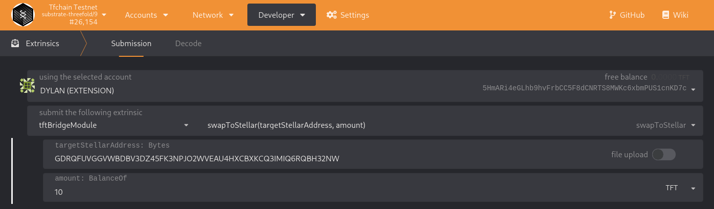

# Transfering TFT between Stellar and TF Chain testnet

## Usage

This document will explain how you can transfer TFT from TF Chain to Stellar and back.

## Prerequisites

- Threefold Connect application or any other Stellar wallet

## Stellar to TF Chain

Transfer the TFT from your Stellar wallet to the following bridge address: `GA2CWNBUHX7NZ3B5GR4I23FMU7VY5RPA77IUJTIXTTTGKYSKDSV6LUA4`. A depositfee of 1 TFT will be taken, so make sure you send a larger amount as 1 TFT.

### Transfer to TF Chain

We also enabled deposits to TF Grid objects. Following objects can be deposited to:

- Twin
- Farm
- Entity
- Node

To deposit to any of these objects, a memo text in format `object_objectID` must be passed on the deposit to the bridge wallet. Example: `twin_1`. 

To deposit to a TF Grid object, this object **must** exists. If the object is not found on chain, a refund is issued.

## TF Chain to Stellar

Browse to https://polkadot.js.org/apps/?rpc=wss%3A%2F%2Ftfchain.test.threefold.io#/extrinsics , select tftBridgeModule and extrinsic: `swap_to_stellar`. Provide your stellar target address and amount and sign it with your account holding the tft balance.
Again, a withdrawfee of 1 TFT will be taken, so make sure you send a larger amount as 1 TFT.

The amount withdrawn from TF Chain will be sent to your Stellar wallet.

Example: 
