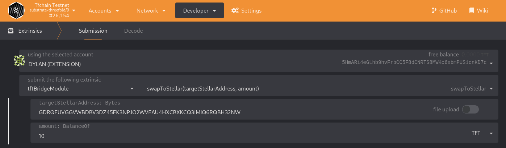

# Transferring TFT between Stellar and TF Chain

## Usage

This document will explain how you can transfer TFT from TF Chain to Stellar and back.

Note: Bridge is connected Stellar Testnet for now.

## Prerequisites

- Ed25519 keypair

Create a keypair with the following tool: https://github.com/threefoldtech/tfchain_tft/tree/main/tfchain_bridge/tools/keygen

```
go build .
./keygen
```

## Stellar to TF Chain

Create a Stellar wallet from the key that you generated.
Transfer the TFT from your wallet to the bridge address GDHJP6TF3UXYXTNEZ2P36J5FH7W4BJJQ4AYYAXC66I2Q2AH5B6O6BCFG. A depositfee of 1 TFT will be taken, so make sure you send a larger amount as 1 TFT.

### Alternative Transfer to TF Chain

We also enabled deposits to TF Grid objects. Following objects can be deposited to:

- Twin
- Farm
- Node
- Entity

To deposit to any of these objects, a memo text in format `object_objectID` must be passed on the deposit to the bridge wallet. Example: `twin_1`. 

To deposit to a TF Grid object, this object **must** exists. If the object is not found on chain, a refund is issued.

## TF Chain to Stellar

Create a TF Chain account from the key that you generated. (TF Chain raw seed).
Browse to https://polkadot.js.org/apps/?rpc=wss%3A%2F%2Ftfchain.dev.threefold.io#/accounts -> Add Account -> Click on mnemonic and select `Raw Seed` -> Paste raw TF Chain seed. 
Select `Advanced creation options` -> Click `Schnorrkel (sr25519)` -> Select `Edwards (ed25519)`. Click `I have saved my mnemonic seed safely` and proceed.

Browse to https://polkadot.js.org/apps/?rpc=wss%3A%2F%2Ftfchain.dev.threefold.io#/extrinsics , select tftBridgeModule and extrinsic: `swap_to_stellar`. Provide your stellar target address and amount and sign it with your account holding the tft balance.
Again, a withdrawfee of 1 TFT will be taken, so make sure you send a larger amount as 1 TFT.

The amount withdrawn from TF Chain will be sent to your Stellar wallet.

Example: 
