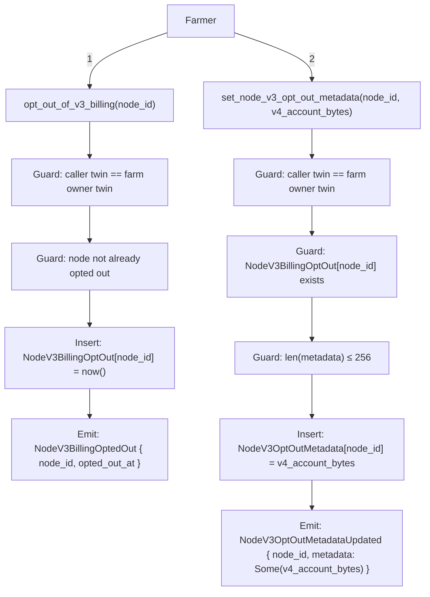
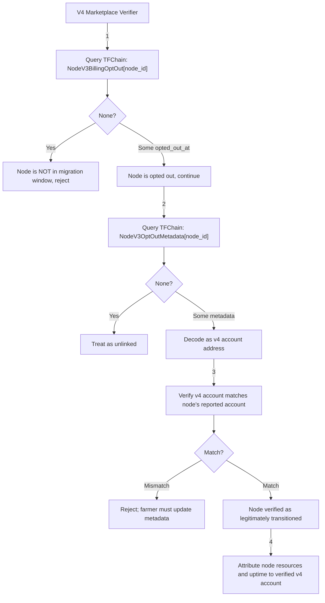

# 26. V3 Node Opt-Out Metadata for V4 Account Linkage

Date: 2026-02-26

## Status

Accepted

## Context

ADR-0025 introduced the `NodeV3BillingOptOut` mechanism allowing farmers to signal that their nodes
are entering a migration window to Mycelium (v4). Once a node is opted out, the marketplace needs
a way to associate that node with a v4 account so that:

1. The v4 marketplace can verify the node is legitimately transitioning and not being double-billed.
2. The v4 marketplace can attribute the node's resources and uptime to the correct farmer identity on v4.
3. The linking is farmer-controlled, on-chain, and auditable — no off-chain oracle or manual mapping is required.

### Options Considered

**Option A: Hero Ledger — mutual authentication via cross-chain signed proof**
The proposal was a **mutual authentication** scheme: a v4 account that wants to claim ownership of a v3 node
would sign a proof using the v3 farmer private key (proving control of the v3 account), then submit
a transaction from the v4 account to store that signed proof in Hero Ledger. Any verifier could then
fetch the proof from KVS, retrieve the v3 farmer's public key from TFChain, and verify the signature —
establishing that the v3 and v4 accounts are controlled by the same party without requiring a
transaction on TFChain.

Rejected because:

- The chosen approach (Option D) achieves the same ownership guarantee more simply: the farmer signs a TFChain extrinsic from their v3 account, which is already the authoritative proof of ownership.

**Option B: TFChain `kvstore` pallet**
Use the existing generic key-value store pallet already deployed on TFChain. Farmers could write their v4
account under a well-known key (e.g. `node:<node_id>:v4_account`). Rejected because the `kvstore` pallet
is scoped per twin — any twin can write to its own namespace but there is no way to enforce that the
writer is the farm owner of a specific node, or to enforce that the node must be opted out before the
key can be set. The linkage would be self-asserted with no on-chain validation of the ownership
relationship, making it unsuitable as a trust anchor for the marketplace verifier.

**Option C: Extend `NodeV3BillingOptOut` map (inline struct)**
Change the existing `NodeV3BillingOptOut` storage value type from a bare `u64` timestamp to a struct
containing both the timestamp and optional metadata. Rejected because it requires a storage migration
for all existing opted-out nodes, couples two distinct concerns (immutable billing state and mutable
v4 linkage) into one storage item, and makes future independent evolution of either field harder.

**Option D: Separate opt-out-gated storage map in pallet-tfgrid (chosen)**
Add a new `NodeV3OptOutMetadata` storage map keyed by `node_id`, only writable when the node has already
opted out. This is additive (no migration), co-located with node data, farmer-controlled, and enforces
the invariant that metadata is only meaningful for opted-out nodes.

### Per-Node vs Per-Farm Storage

An alternative keying was discussed: storing one metadata entry per farm rather than per node. This would
allow a single `set` call to link all nodes on a farm to one v4 account. Rejected in favour of per-node
keying because:

- Nodes on the same farm may migrate at different times and could legitimately map to different v4 accounts.
- The opt-out itself (`NodeV3BillingOptOut`) is per-node, so the metadata key should match to keep the relationship unambiguous.

Per-node keying is more granular, consistent with the existing opt-out model, and keeps the linkage lookup O(1) by node ID.

## Decision

### New Storage Item (pallet-tfgrid)

```rust
NodeV3OptOutMetadata: StorageMap<node_id (u32) → BoundedVec<u8, 256>>
```

- Keyed by node ID; presence is independent of `NodeV3BillingOptOut` at the storage level but enforced at the extrinsic level.
- Max 256 bytes — sufficient to hold any account address format (SS58, hex, bech32) plus a small JSON envelope if needed.
- No storage migration required; purely additive.

### New Extrinsic (pallet-tfgrid)

| Extrinsic | Origin | Call Index |
| --- | --- | --- |
| `set_node_v3_opt_out_metadata(node_id, metadata)` | Farmer (signed) | 46 |

**Preconditions enforced on-chain:**

1. Caller's `AccountId` maps to a twin (`TwinNotExists` otherwise).
2. The node exists (`NodeNotExists` otherwise).
3. The caller's twin is the farm owner twin for the node's farm (`NodeUpdateNotAuthorized` otherwise).
4. The node is already opted out of v3 billing (`NodeNotOptedOutOfV3Billing` otherwise).
5. `metadata.len() ≤ 256` (`NodeV3OptOutMetadataTooLong` otherwise).

**Behaviour:**

- If `metadata` is non-empty: upsert `NodeV3OptOutMetadata[node_id]`, emit `NodeV3OptOutMetadataUpdated { node_id, metadata: Some(metadata) }`.
- If `metadata` is empty: remove `NodeV3OptOutMetadata[node_id]`, emit `NodeV3OptOutMetadataUpdated { node_id, metadata: None }`.

The extrinsic is idempotent and can be called repeatedly to update or clear the metadata. Only the farm owner can call it, matching the ownership model of `opt_out_of_v3_billing`.

### New Events (pallet-tfgrid)

- `NodeV3OptOutMetadataUpdated { node_id: u32, metadata: Option<Vec<u8>> }` — emitted when metadata is set, updated, or cleared. `Some(bytes)` indicates set/update, `None` indicates clear.

### New Errors (pallet-tfgrid)

- `NodeNotOptedOutOfV3Billing` — returned when `set_node_v3_opt_out_metadata` is called for a node that has not yet opted out.
- `NodeV3OptOutMetadataTooLong` — returned when the supplied metadata exceeds 256 bytes.

## Flow

### Full opt-out and linkage sequence



After step 2, `NodeV3OptOutMetadata[node_id]` holds the farmer's v4 account address (or any agreed-upon linking payload).

### V4 Marketplace Verification Flow

When a node registers or reports uptime on the v4 marketplace, the marketplace verifier must:



### Metadata Content Convention

The metadata field is opaque bytes at the pallet level. A UTF-8 JSON object can be used for richer payloads, provided it stays within 256 bytes. For example:

```json
{"schema":"v1","account":"5GrwvaEF5zXb26Fz9rcQpDWS57CtERHpNehXCPcNoHGKutQY"}
```

The marketplace should document and enforce its expected format. The pallet enforces only the length bound.

## Consequences

- **No storage migration**: additive change only; existing nodes and storage layouts are unaffected.
- **Farmer-controlled linkage**: the farm owner has sole authority to set or update the v4 account link, matching the existing ownership model.
- **Invariant enforced on-chain**: metadata can only exist for opted-out nodes, preventing invalid or premature linking.
- **Auditable**: all set and clear operations emit events, providing a full on-chain history of linkage changes.
- **Marketplace trust model**: the v4 marketplace must perform two chain queries (opt-out status + metadata) to verify a node. This is a read-only operation and adds no write overhead to the critical paths.
- **Clearing supported**: farmers can clear the metadata by passing empty bytes, which removes the storage entry entirely.
