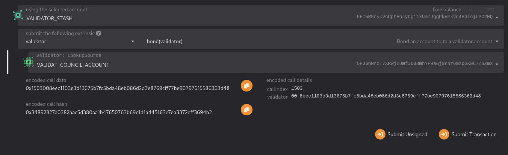
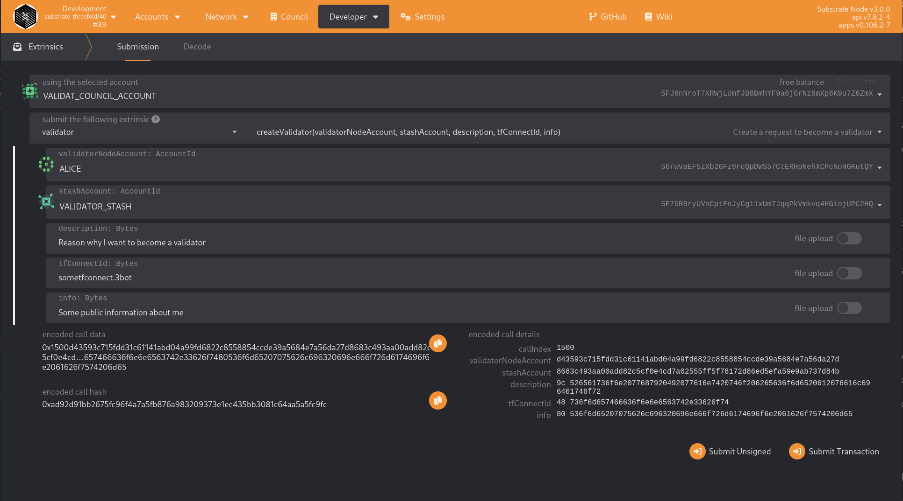
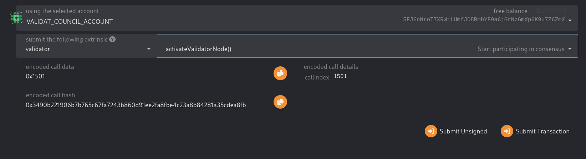

# Apply for a Validatorship

## Requirements

Check the [adding validators guide](./adding_validators.md) and make sure you meet the [Prerequisites](./adding_validators.md#prerequisites) and hardware [requirements](./adding_validators.md#hardware).

## 1. Generate Keys

Follow [step 1](./adding_validators.md#1-generate-keys)

Optionally, generate a third account (a stash account) similarly to how you [generate the validator account key](./adding_validators.md#11-generate-the-validator-account-key)

## 2. Insert AURA/GRAN Keys

Follow [step 2](./adding_validators.md#2-start-the-validator-node) and [step 3](./adding_validators.md#3-synchronize-the-node-using-warp-sync)

## 3. Connect The Session Key To The Controller Account

Follow [step 4](./adding_validators.md#4-set-session-keys-on-chain)

Your node is now running in validator mode. Next, you need to apply for a Validatorship and manually activate the validator.

## 4. Setup a Stash Account (Optional)

Bonding an account is optional; you can skip this step and continue to the next step.

- Open the Polkadot.js browser extension.
- Import your stash account using the mnemonic from step 1 in this document.
- Go to `Developer` -> `Extrinsics` and select your `Stash` account. Now from the left dropdown (modules) search for `validator`
- Select `bond(validator)` and select the target account to be your account that manages the Validator and manages your council membership (voting). (You previously created).
- Now click `Submit Transaction`.

## 5. Apply for a Validatorship

- Now go to `Developer` -> `Extrinsics` and select your `VALIDATOR_ACCOUNT` account. From the left dropdown (modules) search for `validator` and select the method: `createValidatorRequest(...)`
- This call needs to be signed with your account (`VALIDATOR_ACCOUNT`) that manages the Validator and manages your council membership (voting). (You previously created).
- Information needed:
  - validator_node_account: Account ID generated from previous step (`VALIDATOR_NODE_ACCOUNT`)
  - stash_account: Stash account, can be your `VALIDATOR_ACCOUNT`
  - description: Reason why you want to become a validator
  - tfconnectid: Your Threefold connect name
  - info: Link to webpage or LinkedIn profile
- If all information is filled in correctly, click on `Submit transaction` and sign. If all goes well, the Council will approve your request.

## 6. Activate The Validator

If your request is approved by the council AND your tfchain node is fully synced with the network, you can activate your validator. This will kickstart block production after 2 eras.

- Go to `Developer` -> `Extrinsics` and select your `VALIDATOR_ACCOUNT` that manages the Validator and manages your council membership.
- From the left dropdown (modules) search for `validator`.
- Select `ActivateValidatorNode` and click Submit Transaction.

