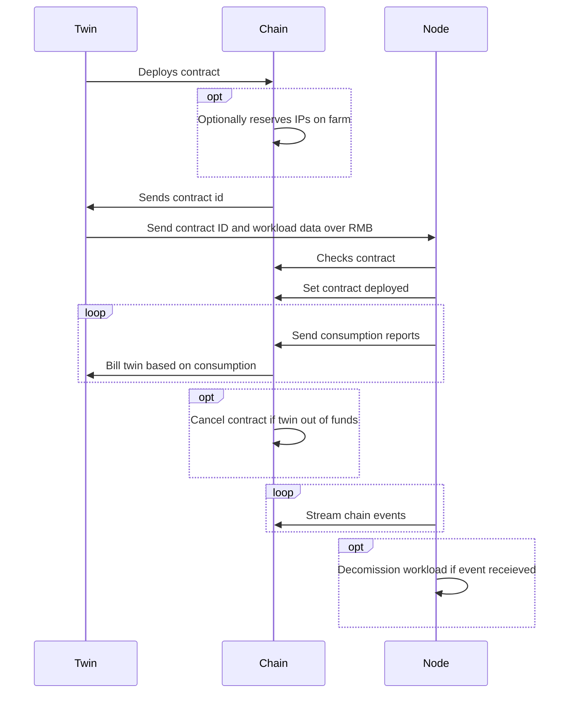

```mermaid
sequenceDiagram
    Twin->>Chain: Deploys contract
    opt
    Chain->>Chain: Optionally reserves IPs on farm
    end
    Chain->>Twin: Sends contract id
    Twin->>Node: Send contract ID and workload data over RMB
    Node->>Chain: Checks contract
    Node->>Chain: Set contract deployed
    loop
    Node->>Chain: Send consumption reports
    Chain->>Twin: Bill twin based on consumption
    end
    opt
    Chain->>Chain: Cancel contract if twin out of funds
    end
    loop
    Node->>Chain: Stream chain events
    end
    opt
    Node->>Node: Decomission workload if event receieved
    end
```