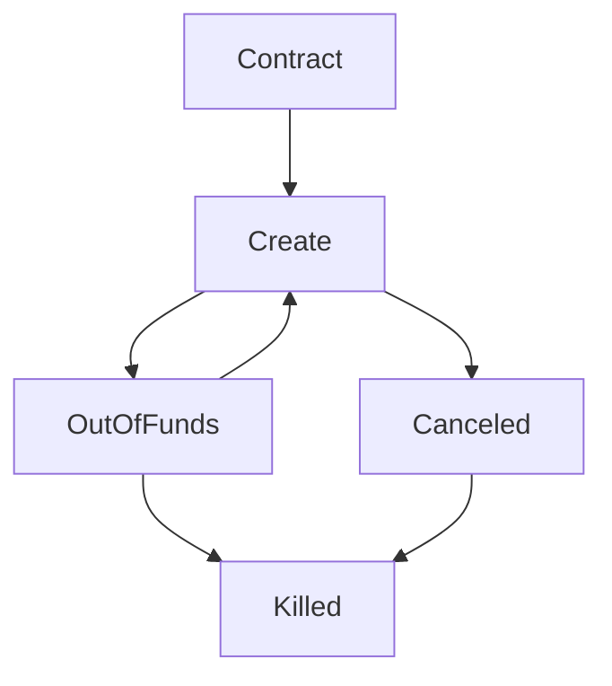

# Proposal contract flow

## Create

Contract object is created, storage is initialized. Billing cycles are enabled. 

## Out Of Funds

Contract state is set to Out Of Funds when the wallet of the users does not contain enough tokens to pay for deployment. A grace period can be implemented here so the workload is not instantly removed.

If the wallet of the user is funded again, the chain will set the state of the contract back to create.

## Canceled

Contract is canceled by user. Storage is not cleaned up yet and billing will still trigger (this to bill remaining time it was running on a zos node).

## Killed

Contract objects are removed, billing cycle is disabled.