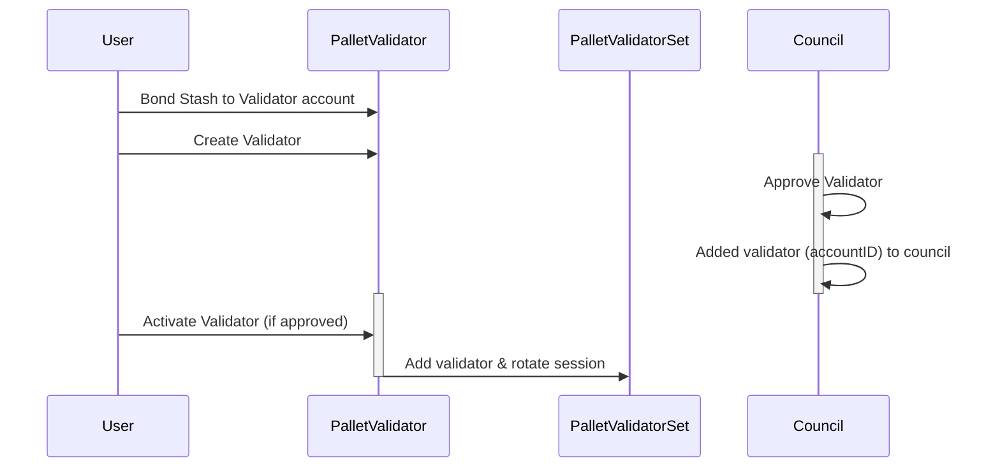

# Validator request flow

```mermaid
sequenceDiagram
    participant U as User
    participant P as PalletValidator
    participant PV as PalletValidatorSet
    participant C as Council
    U->>P: Bond Stash to Validator account
    U->>P: Create Validator
    activate C
    C->>C: Approve Validator
    C->>C: Added validator (accountID) to council
    deactivate C
    activate P
    U->>P: Activate Validator (if approved)
    P->>PV: Add validator & rotate session
    deactivate P
```