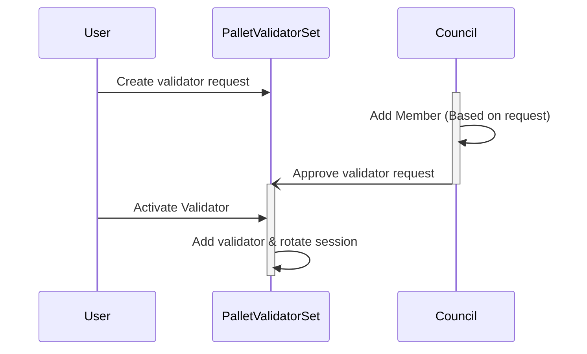

```mermaid
sequenceDiagram
    participant U as User
    participant P as PalletValidatorSet
    participant C as Council
    U->>P: Create validator request
    activate C
    C->>C: Add Member (Based on request)
    C-)P: Approve validator request
    deactivate C
    activate P
    U->>P: Activate Validator
    P->>P: Add validator & rotate session
    deactivate P
```