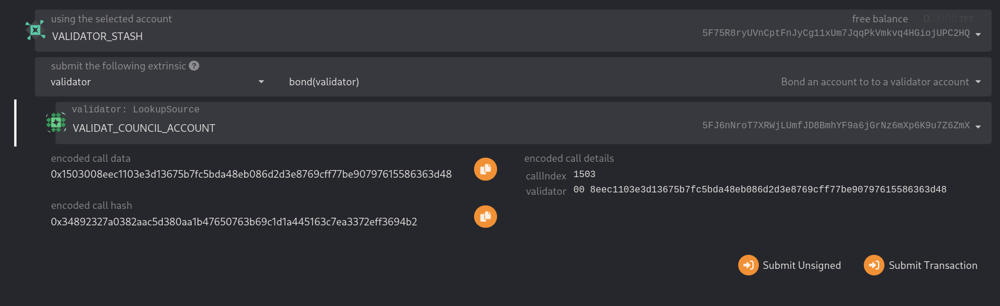
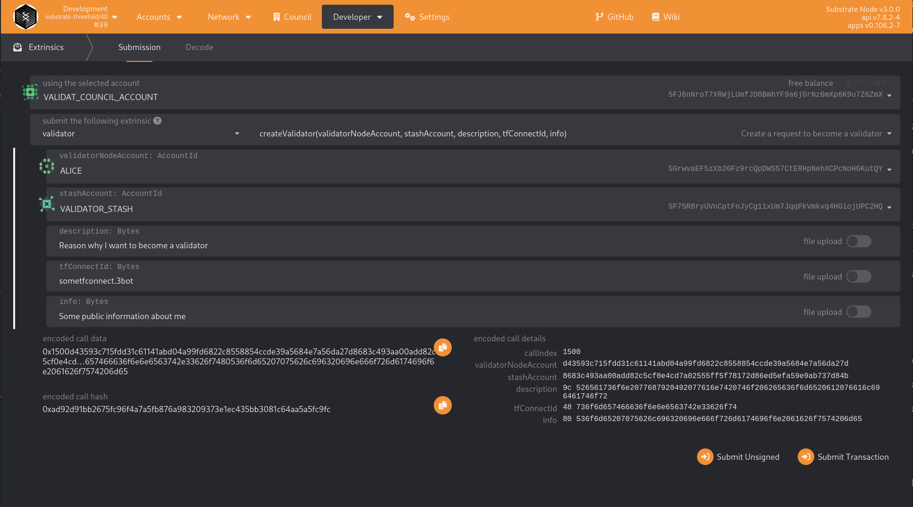
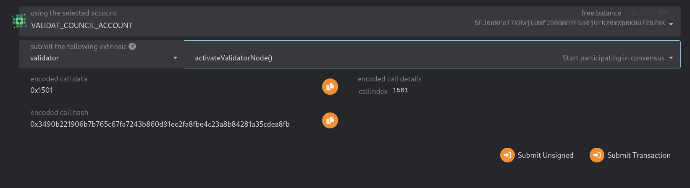

# Adding validators to an existing Tfchain network

### Requirements

The most common way for a beginner to run a validator is on a cloud server running Linux. You may choose whatever VPS provider that your prefer, and whatever operating system you are comfortable with.
For this guide we will be using Ubuntu 18.04, but the instructions should be similar for other platforms.

The transactions weights in TFchain were benchmarked on standard hardware. It is recommended that validators run at least the standard hardware in order to ensure they are able to process all blocks in time. The following are not minimum requirements but if you decide to run with less than this beware that you might have performance issue.

Standard Hardware
For the full details of the standard hardware please see here.

- CPU - Intel(R) Core(TM) i7-7700K CPU @ 4.20GHz
- Storage - A NVMe solid state drive. Should be reasonably sized to deal with blockchain growth. Starting around 80GB - 160GB will be okay for the first six months of TFchain, but will need to be re-evaluated every six months.
- Memory - 64GB ECC.

The specs posted above are by no means the minimum specs that you could use when running a validator, however you should be aware that if you are using less you may need to toggle some extra optimizations in order to be equal to other validators that are running the standard.


## Node Prerequisites: Install Rust and Dependencies

Once you choose your cloud service provider and set-up your new server, the first thing you will do is install Rust.

If you have never installed Rust, you should do this first.

If you have already installed Rust, run the following command to make sure you are using the latest version.

`rustup update`

If not, this command will fetch the latest version of Rust and install it.

`curl https://sh.rustup.rs -sSf | sh -s -- -y`

To install nightly:
```
rustup install nightly-2021-06-09
```

Add Wasm toolchain:
```
rustup target add wasm32-unknown-unknown --toolchain nightly-2021-06-09
```

> If you do not have "curl" installed, run "sudo apt install curl"

To configure your shell, run the following command.

`source $HOME/.cargo/env`

Verify your installation.

`rustc --version`

Finally, run this command to install the necessary dependencies for compiling and running the Polkadot node software.

`sudo apt install make clang pkg-config libssl-dev build-essential`

Note - if you are using OSX and you have Homebrew installed, you can issue the following equivalent command INSTEAD of the previous one:

`brew install cmake pkg-config openssl git llvm`

## Install & Configure Network Time Protocol (NTP) Client

NTP is a networking protocol designed to synchronize the clocks of computers over a network. NTP allows you to synchronize the clocks of all the systems within the network. Currently it is required that validators' local clocks stay reasonably in sync, so you should be running NTP or a similar service. You can check whether you have the NTP client by running:

If you are using Ubuntu 18.04 / 19.04, NTP Client should be installed by default.

`timedatectl`

If NTP is installed and running, you should see System clock synchronized: yes (or a similar message). If you do not see it, you can install it by executing:

`sudo apt-get install ntp`

ntpd will be started automatically after install. You can query ntpd for status information to verify that everything is working:

`sudo ntpq -p`

> WARNING: Skipping this can result in the validator node missing block authorship opportunities. If the clock is out of sync (even by a small amount), the blocks the validator produces may not get accepted by the network. This will result in ImOnline heartbeats making it on chain, but zero allocated blocks making it on chain.

## TFchain Binary

You will need to build the tfchain binary from the threefoldtech/tfchain repository on GitHub.

Release to use for different networks:

- Mainnet: 1.0.0 (git checkout 1.0.0)
- Testnet: 1.0.0-b1 (git checkout 1.0.0-b1)
- Devnet: 1.0.0-b9 (git checkout 1.0.0-b9)

Note: If you prefer to use SSH rather than HTTPS, you can replace the first line of the below with git clone git@github.com:threefoldtech/tfchain.git.

```
git clone https://github.com/threefoldtech/tfchain.git
cd substrate-node
git checkout 1.0.0
```

Now build the binary

```
cargo +nightly-2021-06-09 build --release
```

This step will take a while (generally 10 - 40 minutes, depending on your hardware).

## Key management

If you are interested in generating keys locally, you can also install subkey from the same directory. You may then take the generated subkey executable and transfer it to an air-gapped machine for extra security.

```
cargo install --force --git https://github.com/paritytech/substrate subkey
```

## Synchronize Chain Data

You can now start synchronising chain data.

Bootnodes examples:

- Devnet bootnode: `/ip4/185.206.122.7/tcp/30333/p2p/12D3KooWLcMLBg9itjQL1EXsAqkJFPhqESHqJKY7CBKmhhhL8fdp`
- Testnet bootnode: `/ip4/51.68.204.40/tcp/30333/p2p/12D3KooWHe8Wbn6dDbyxXietaXSRTZJfykPRgrkJDjXh9xZ4383k`
- Mainnet bootnode: `/ip4/185.206.122.83/tcp/30333/p2p/12D3KooWLtsdtQHswnXkLRH7e8vZJHktsh7gfuL5PoADV51JJ6wY`

You can begin syncing your node by running the following command:

`./target/release/tfchain --chain chainspecs/main/chainSpec.json --pruning=archive --bootnodes /ip4/185.206.122.83/tcp/30333/p2p/12D3KooWLtsdtQHswnXkLRH7e8vZJHktsh7gfuL5PoADV51JJ6wY --telemetry-url 'wss://shard1.telemetry.tfchain.grid.tf/submit 1'`

The `--chain chainspecs/network/chainSpec.json` flag is different for every network, see above (Tfchain Binary). If you want to sync with testnet for example you need to check out the git repository on `1.0.0-b1`.

if you do not want to start in validator mode right away.

```
2022-02-18 15:45:22  Substrate Node    
2022-02-18 15:45:22  ✌️  version 3.0.0-138e5f5-x86_64-linux-gnu    
2022-02-18 15:45:22  ❤️  by Substrate DevHub <https://github.com/substrate-developer-hub>, 2017-2022    
2022-02-18 15:45:22  📋 Chain specification: Tfchain Mainnet    
2022-02-18 15:45:22  🏷 Node name: milky-woman-6216    
2022-02-18 15:45:22  👤 Role: AUTHORITY    
2022-02-18 15:45:22  💾 Database: RocksDb at /home/user/.local/share/tfchain/chains/tfchain_mainnet/db    
2022-02-18 15:45:22  ⛓  Native runtime: substrate-threefold-40 (substrate-threefold-1.tx1.au1)    
2022-02-18 15:45:23  🔨 Initializing Genesis block/state (state: 0x7526…4fb6, header-hash: 0x84cb…5e7b)    
2022-02-18 15:45:23  👴 Loading GRANDPA authority set from genesis on what appears to be first startup.    
2022-02-18 15:45:23  ⏱  Loaded block-time = 6000 milliseconds from genesis on first-launch    
2022-02-18 15:45:23  Using default protocol ID "sup" because none is configured in the chain specs    
2022-02-18 15:45:23  🏷 Local node identity is: 12D3KooWPyq94pmzZ9RQAvrU1SsShjmEVgfgMvyeBifFGf98wdf6    
2022-02-18 15:45:23  📦 Highest known block at #1231
```

Example of node sync:

```
2021-06-17 03:07:39 🔍 Discovered new external address for our node: /ip4/10.26.16.1/tcp/30333/ws/p2p/12D3KooWLtXFWf1oGrnxMGmPKPW54xWCHAXHbFh4Eap6KXmxoi9u
2021-06-17 03:07:40 ⚙️  Syncing 218.8 bps, target=#5553764 (17 peers), best: #24034 (0x08af…dcf5), finalized #23552 (0xd4f0…2642), ⬇ 173.5kiB/s ⬆ 12.7kiB/s
2021-06-17 03:07:45 ⚙️  Syncing 214.8 bps, target=#5553765 (20 peers), best: #25108 (0xb272…e800), finalized #25088 (0x94e6…8a9f), ⬇ 134.3kiB/s ⬆ 7.4kiB/s
2021-06-17 03:07:50 ⚙️  Syncing 214.8 bps, target=#5553766 (21 peers), best: #26182 (0xe7a5…01a2), finalized #26112 (0xcc29…b1a9), ⬇ 5.0kiB/s ⬆ 1.1kiB/s
2021-06-17 03:07:55 ⚙️  Syncing 138.4 bps, target=#5553767 (21 peers), best: #26874 (0xcf4b…6553), finalized #26624 (0x9dd9…27f8), ⬇ 18.9kiB/s ⬆ 2.0kiB/s
2021-06-17 03:08:00 ⚙️  Syncing 37.0 bps, target=#5553768 (22 peers), best: #27059 (0x5b73…6fc9), finalized #26624 (0x9dd9…27f8), ⬇ 14.3kiB/s ⬆ 4.4kiB/s
```

The `--pruning=archive` flag is implied by the `--validator` flag, so it is only required explicitly if you start your node without one of these two options. If you do not set your pruning to archive node, even when not running in validator mode, you will need to re-sync your database when you switch.

If you are interested in determining how much longer you have to go, your server logs (printed to STDOUT from the polkadot process) will tell you the latest block your node has processed and verified. You can then compare that to the current highest block via the [PolkadotJS Block Explorer](https://polkadot.js.org/apps/?rpc=wss%3A%2F%2Ftfchain.grid.tf#/explorer).

## Create a Validator object

- dev: https://polkadot.js.org/apps/?rpc=wss%3A%2F%2Ftfchain.dev.grid.tf#/accounts
- test: https://polkadot.js.org/apps/?rpc=wss%3A%2F%2Ftfchain.test.grid.tf#/accounts
- main: https://polkadot.js.org/apps/?rpc=wss%3A%2F%2Ftfchain.grid.tf#/accounts

Open polkadot js link in the browser based on the network you want to validate on.

- Browse to `accounts` and click `Add Account`, create an account and name it `VALIDATOR_ACCOUNT`. Take note of the mnemonic.
This account will be your account that manages the Validator and manages your council membership (voting). Make sure to send some TFT to this account.
- (Optional) Create another account and name it `ANYNAME_STASH`. This account will be your stash account.
- Create one more account and call it `VALIDATOR_NODE_ACCOUNT`, this account will be used to participate in consensus.

You now should have 3 accounts.

Note: Both `VALIDATOR_ACCOUNT` and `VALIDATOR_NODE_ACCOUNT` need atleast 0.1 TFT in order to make a validator object.

> Bonding an account is optional, you can skip this step and continue to the next step.

Now go to `Developer` -> `Extrinsicis` and Select your `Stash` account. Now from the left dropdown (modules) search `validator`



Select `bond(validator)` and select the target account to be your account that manages the Validator and manages your council membership (voting). (You previously created).

Now click `Submit Transaction`.



Now go to `Developer` -> `Extrinsicis` and Select your `VALIDATOR_ACCOUNT` account. Now from the left dropdown (modules) search `validator` and select the method: `createValidator(...)`

This call needs to be signed with your account (`VALIDATOR_ACCOUNT`) that manages the Validator and manages your council membership (voting). (You previously created).

Information needed:

- validator_node_account: Account ID generated from previous step (`VALIDATOR_NODE_ACCOUNT`)
- stash_account: Stash account, can be your `VALIDATOR_ACCOUNT`
- description: Reason why I want to become a validator
- tfconnectid: Your Threefold connect name
- info: link to webpage or linked in profile

If all information is filled in correctly. Click on `Submit transaction` and sign. If all goes well, the Council will approve your request.

### Insert AURA/GRAN Keys

Mnemonic: Words from the created account (`VALIDATOR_NODE_ACCOUNT`) created in a the previous steps.

Transfer some balance to this account (you can see the address in the polkadot UI). (0.1 TFT should be enough). You can transfer the balance to this account from the polkadot UI.

```
./target/release/tfchain key insert --key-type aura --suri "<VALIDATOR_NODE_ACCOUNT_WORDS>" --chain chainspecs/main/chainSpecRaw.json
./target/release/tfchain key insert --key-type gran --suri "<VALIDATOR_NODE_ACCOUNT_WORDS>" --chain chainspecs/main/chainSpecRaw.json
```

### Generate session key

Restart tfchain with:

```
./target/release/tfchain ...otherArgs --ws-external --rpc-methods Unsafe --rpc-external --telemetry-url 'wss://shard1.telemetry.tfchain.grid.tf/submit 1'
```

Connect to the new node deployed with polkadot js apps. You will need to install a local version of this application since you will have to connect over a not secured websocket.

Source: https://github.com/polkadot-js/apps

```
git clone git@github.com:polkadot-js/apps.git
cd apps
yarn
yarn start
```

Browse to http://localhost:3000 and connect to the new node over it's public ip. Make sure to specify the port, like: ws://YOUR_MACHINE_PUBLIC_IP:9944

First insert the types: Go to `Settings` -> `Developer` -> Copy paste output of following [file](https://raw.githubusercontent.com/threefoldtech/tfchain_client_js/master/types.json)

Go to `Developer` -> `RPC calls` -> `author` -> `rotateKeys`, excecute it and take note of the output.

Go to `Extrinsics` -> `session` -> `setKeys` -> (make sure to use the created node account (`VALIDATOR_NODE_ACCOUNT`), created above) You will need to import this account into this local polkadot js apps UI. Make sure it has atleast 0.1 TFT.

input:
```
keys: the key from rotate keys ouput
proofs: 0
```

Now we can start the node in Validator mode:

Restart tfchain and remove flags: `--ws-external --rpc-methods Unsafe --rpc-external` and replace that with `--validator`

Your node is now running in validator mode. Next up you need to manually activate the validator.

## Activate validator

If your request is approved by the council AND your tfchain node is fully synced with the network you can activate your validator. This will kickstart block production.

Now go to `Developer` -> `Extrinsicis` and Select your account that manages the Validator and manages your council membership (voting). (You previously created).. Now from the left dropdown (modules) search `validator`.



Select `ActivateValidatorNode` and click Submit Transaction. 


## Managing TFChain with systemd

Example systemd file:

```
[Unit]
Description=TFchain service
After=network.target
StartLimitIntervalSec=0

[Service]
Type=simple
Restart=always
RestartSec=1
User=user
ExecStart=/home/user/tfchain/substrate-node/target/release/tfchain --chain /home/user/tfchain/substrate-node/chainspecs/dev/chainSpec.json --pruning=archive --bootnodes /ip4/185.206.122.7/tcp/30333/p2p/12D3KooWLcMLBg9itjQL1EXsAqkJFPhqESHqJKY7CBKmhhhL8fdp --validator --telemetry-url 'wss://shard1.telemetry.tfchain.grid.tf/submit 1'

[Install]
WantedBy=multi-user.target
```

Replace `user` by your username.

`sudo vim /etc/systemd/system/tfchain.service` -> paste content.

### Starting service

`sudo systemctl start tfchain` 

### Stopping service

`sudo systemctl stop tfchain` 

### Reload config

`sudo systemctl stop tfchain` 

Edit File

`sudo systemctl start tfchain`
