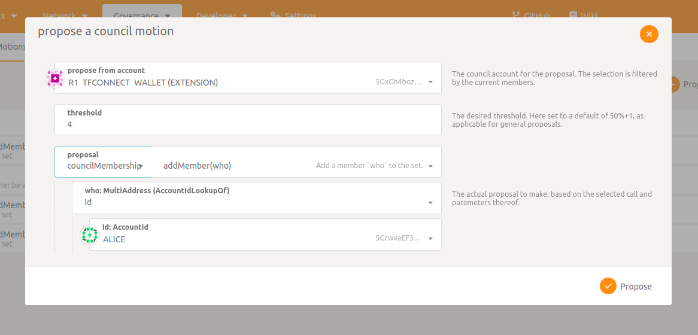
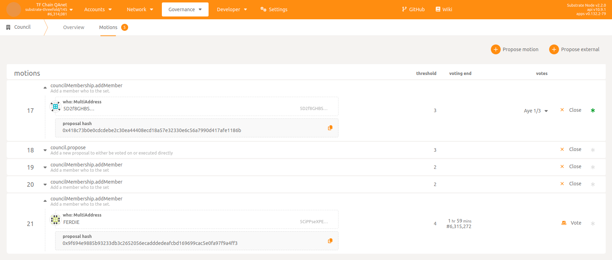
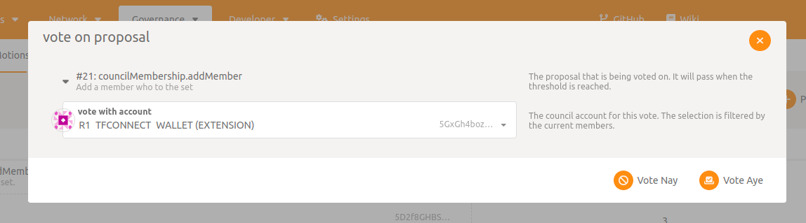

# Creating a motion for council members to vote on

Such council motion is ruled by [pallet Collective](https://paritytech.github.io/substrate/master/pallet_collective/index.html).
Only a council member can propose a motion for council members to vote on.

## Step 1: Go to Polkadot UI

Open the Polkadot JS UI in your browser:

*   devnet:   https://polkadot.js.org/apps/?rpc=wss%3A%2F%2Ftfchain.dev.grid.tf#/explorer
*   qanet:    https://polkadot.js.org/apps/?rpc=wss%3A%2F%2Ftfchain.qa.grid.tf#/explorer
*   testnet:  https://polkadot.js.org/apps/?rpc=wss%3A%2F%2Ftfchain.test.grid.tf#/explorer
*   mainnet:  https://polkadot.js.org/apps/?rpc=wss%3A%2F%2Ftfchain.grid.tf#/explorer

## Step 2: Propose a council motion

*   Make sure the council member account is registered on the Polkadot browser extension
*   Go to `Motions` ->  `Propose motion`
*   Make sure the council member account is selected

## Step 3: Fill motion

The motion must include the following arguments:

*   `threshold`: number of votes that determine if the motion can be approved (`nb Yes votes >= threshold`) or disapproved (`nb No votes > nb of council members - threshold`). Make sure to set it greater or equal to `3/5` in proportion of total number of council members (see [approval](#approval) section).
*   `proposal`: call/extrinsic to execute on chain. See complete list of extrinsics eligible to be executed by a council approval above. Also, all arguments of selected extrinsic must be filled.

## Step 4: Propose motion

Make sure you have enought funds for transaction fee, click on `Propose` and submit the transaction.
If succeeded you should be able to see the motion in `Propose` section with its corresponding index and details.

! Remark: Once a motion is created it cannot be altered or removed !

## Step 5: Vote for motion

Once the motion started a council member can vote for it by clicking on `Vote`, selecting `Vote Nay` or `Vote Aye` and `Sign and Submit` the transaction.

## Step 6: Close motion

After the motion ends (duration is 2 hours) or, before it, if a `threshold` approval or disapproval condition is reached, it can be manually closed by a council member by clicking on `Close`.

## Approval

Once the motion is closed it is removed from list and the `proposal` extrinsic is executed on chain in case of approval.

! Remark: When the extrinsic is executed there is no guaranty of success. Indeed, all extrinsics callable by a council approval (see list below) require a number of `Yes` votes which is greater or equal to `3/5` in proportion of total number of council members. A `BadOrigin` error message will be received if this condition is not reached !

## List of extrincics requiring a council approval

### tfgridModule

*   `setStorageVersion()` (sets a storage version on pallet)
*   `setFarmCertification()` (sets a certification type on a farm)
*   `setNodeCertification()` (sets a certification type on a node)
*   `createPricingPolicy()` (create a pricing policy)
*   `updatePricingPolicy()` (update a pricing policy by id)
*   `createFarmingPolicy()` (create a farming policy)
*   `setFarmDedicated()` (mark a farm as dedicated, this enabled dedicated nodes on that farm)
*   `forceResetFarmIp()` (resets a farm IP's contract id in case of an issue)
*   `setConnectionPrice()` (price defined in musd, 0.08 -> 800)
*   `addNodeCertifier()` (an account to be allowed to certify nodes)
*   `removeNodeCertifier()` (an account to be removed as node certifier)
*   `updateFarmingPolicy()` (update a farming policy by id)
*   `attachPolicyToFarm()` (attaches a farming policy limit to a specific farm)
*   `setZosVersion()` (sets ZOS version)

### smartContractModule

*   `cancelContract()` (cancels a contract)
*   `approveSolutionProvider()` (approves a solution provider)
*   `changeBillingFrequency()` (changes the billing frequency)

### tftBridgeModule

*   `addBridgeValidator()`
*   `removeBridgeValidator()`
*   `setFeeAccount()`
*   `setWithdrawFee()`
*   `setDepositFee()`

### tftPriceModule

*   `setMinTftPrice()` (sets lower bound for on chain TFT price)
*   `setMaxTftPrice()` (sets upper bound for on chain TFT price)

### validator

*   `approveValidator()` (approves a validator request)
*   `removeValidator()` (removes a validator)

### councilMembership

*   `addMember()` (adds a new council member)
*   `removeMember()` (removes a council member)
*   `swapMember()`
*   `resetMembers()`
*   `setPrime()`
*   `clearPrime()`

### runtimeUpgrade

*   `runtimeUpgrade.setCode()` (new runtime wasm)
