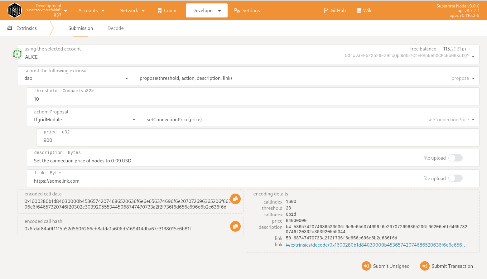
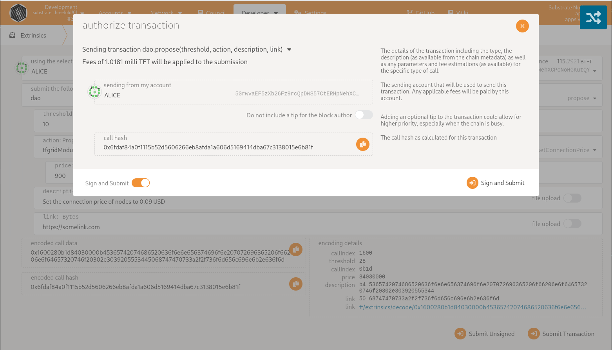
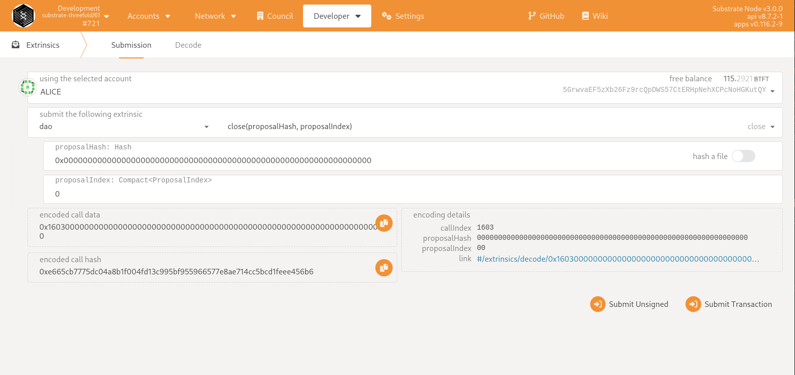

# Creating a Proposal for farmers to vote on

A council member can create a proposal for farmers to vote on. The proposal includes the following:

- Threshold: number of farmers to vote for the proposal in order for it to be valid.
- Action: call to execute on chain. If there is no call to be executed then `system` -> `setRemark` should be set.
- Description: a small description of what the proposal is about.
- Link: a link to a more elaborate explanation of the proposal.

By default a proposal can be voted on for 7 days after being created. After this period it ends, it must be manually closed.

! Remark: Once a proposal is created it cannot be altered !

## Step 1

Open the Polkadot JS UI in your browser:

- devnet: https://polkadot.js.org/apps/?rpc=wss%3A%2F%2Ftfchain.dev.grid.tf%2Fws#/extrinsics
- testnet: https://polkadot.js.org/apps/?rpc=wss%3A%2F%2Ftfchain.test.grid.tf%2Fws#/extrinsics
- mainnet: https://polkadot.js.org/apps/?rpc=wss%3A%2F%2Ftfchain.grid.tf%2Fws#/extrinsics

## Step 2

Identify what call (action) needs to be executed. Options are:

### TFgrid module

- `tfgridModule.setConnectionPrice` (price defined in musd, 0.08 -> 800)
- `tfgridModule.addNodeCertifier` (an account to be allowed to certify nodes)
- `tfgridModule.removeNodeCertifier` (an account to be removed as node certifier)
- `tfgridModule.setFarmDedicated` (mark a farm as dedicated, this enabled dedicated nodes on that farm)
- `tfgridModule.attachPolicyToFarm` (attaches a farming policy limit to a specific farm)
- `tfgridModule.createFarmingPolicy` (create a farming policy)
- `tfgridModule.updateFarmingPolicy` (update a farming policy by id)
- `tfgridModule.createPricingPolicy` (create a pricing policy)
- `tfgridModule.updatePricingPolicy` (update a pricing policy by id)
- `tfgridModule.setFarmCertification` (sets a certification type on a farm)
- `tfgridModule.forceResetFarmIp` (resets a farm IP's contract id in case of an issue)

### Validators

- `validator.approveValidator` (approve a validator request)
- `validator.removeValidator` (removes a validator)

### Runtime upgrade

- `runtimeUpgrade.setCode` (new runtime wasm)

## Step 3

Define the proposal:

## Step 4

Submit the proposal

## Step 5 

Closing a proposal after the proposal ended. This will approve / disapprove the proposal and execute the call on chain. 

Provided:

- Proposal hash (can be found by listing active proposals)
- Proposal index (can be found by listing active proposals)

