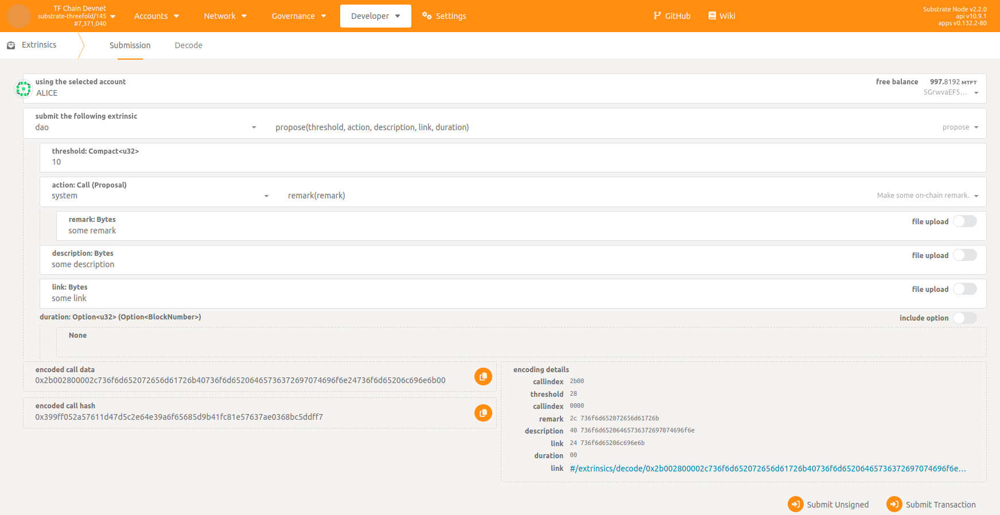
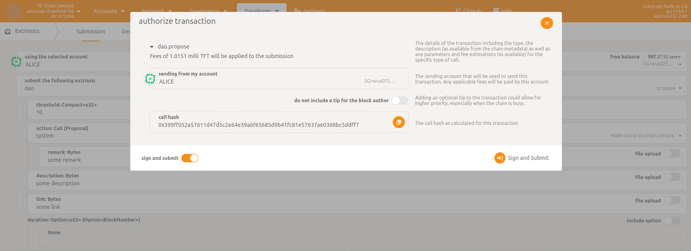
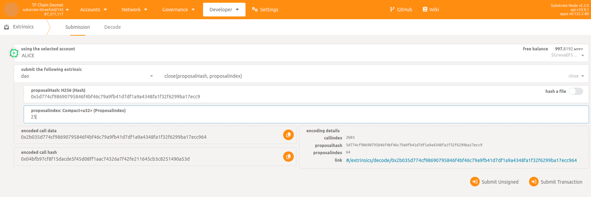
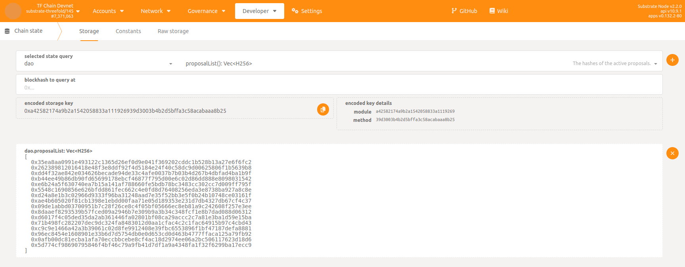
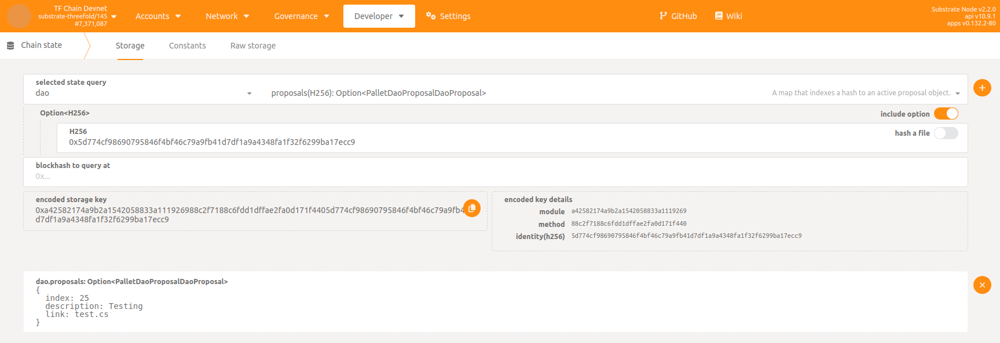
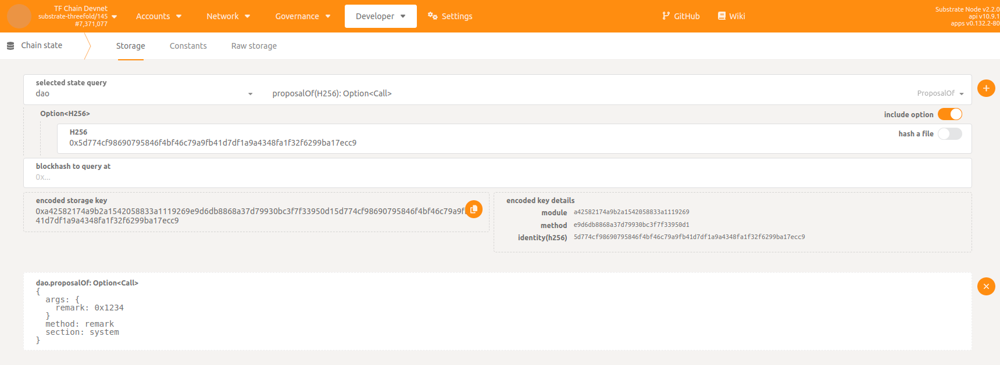
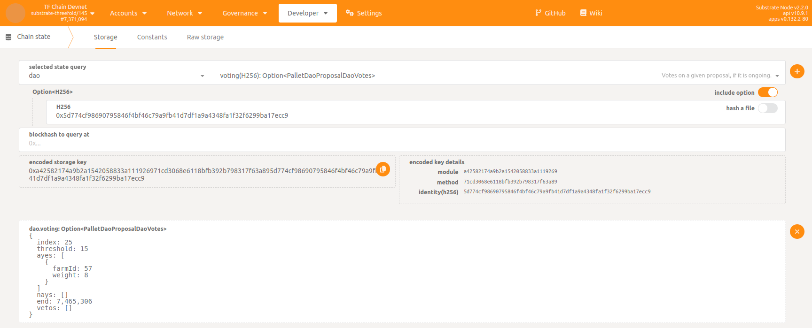
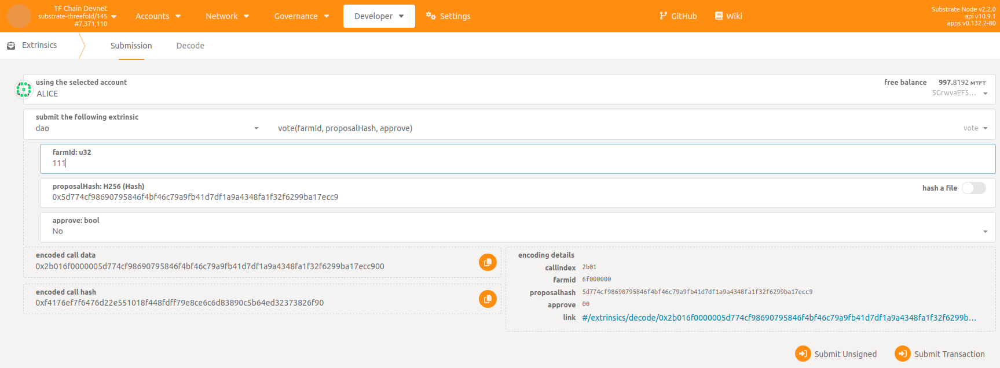
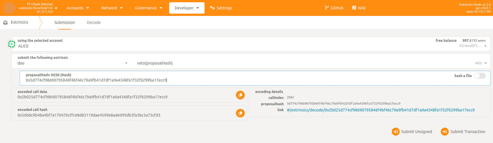

# Creating a proposal for farmers to vote on

Only a council member can create a proposal for farmers to vote on.

## Step 1: Go to Polkadot UI

Open the Polkadot JS UI in your browser:

-  devnet:  https://polkadot.js.org/apps/?rpc=wss%3A%2F%2Ftfchain.dev.grid.tf%2Fws#/explorer
-  qanet:   https://polkadot.js.org/apps/?rpc=wss%3A%2F%2Ftfchain.qa.grid.tf%2Fws#/explorer
-  testnet: https://polkadot.js.org/apps/?rpc=wss%3A%2F%2Ftfchain.test.grid.tf%2Fws#/explorer
-  mainnet: https://polkadot.js.org/apps/?rpc=wss%3A%2F%2Ftfchain.grid.tf%2Fws#/explorer

## Step 2: Open proposal

-  Go to `Developer` -> `Extrinsics`
-  Make sure the council member account is selected
-  Select `dao` -> `propose()` extrinsic

## Step 3: Fill proposal

The proposal must include the following arguments:

-  `threshold`: minimal number of farmer votes required to be able to close proposal before its end.
-  `action`: call/extrinsic to execute on chain. If there is no call to be executed (which is usually the case) then `system` -> `remark()` should be set.
-  `description`: a small description of what the proposal is about.
-  `link`: a link to a more elaborate explanation of the proposal.
-  `duration`: optional duration of the proposal after beeing created (default is 7 days, max value is 30 days), expressed in number of blocks (1 block = 6 sec).

## Step 4: Submit proposal

Make sure you have enought funds for transaction fee and submit the proposal.
If succeeded you should be able to [track the proposal](#check-proposal).

! Remark: Once a proposal is created it cannot be altered or removed !

## Step 5: Closing proposal

After the proposal ends or, before it, if number of votes reached `threshold`, it can be manually closed by a council member.

-  Go to `Developer` -> `Extrinsics`
-  Make sure the council member account is selected
-  Select `dao` -> `close()` extrinsic
-  Fill `proposalHash` and `proposalIndex` (can be found in [list of active proposals](#check-proposal)) and submit transaction

## Approval

Once closed the proposal is removed from list and the action, if any, is executed on chain in case of approval.
Since each farmer vote is weighted by the corresponding farm capacity (`weight = 2 * (sum of CU of all nodes) + (sum of SU of all nodes)`), approval is obtained when `Yes` votes quantity is strictly greater than `No` votes quantity.

## Check proposal

You can check if proposal was created.

-  Go to `Developer` -> `Chain state` -> `dao` -> `proposalList()` to get the hash list of active proposals

-  With the given hash, go to  `Developer` -> `Chain state` -> `dao` -> `proposals()` to see proposal index/description/link

-  With the given hash, go to  `Developer` -> `Chain state` -> `dao` -> `proposalOf()` to see proposal action

-  With the given hash, go to  `Developer` -> `Chain state` -> `dao` -> `voting()` to see ongoing voting status

## Farmer voting

Once proposal is created farmers can vote for it. 

-  Go to `Developer` -> `Extrinsics`
-  Make sure the farmer account is selected.
-  Select `dao` -> `vote()` extrinsic

The vote must include the following arguments:

-  `farmId`: the farm id of the farmer
-  `proposalHash`: the hash of the proposal (can be found in [list of active proposals](#check-proposal))
-  `approve`: `Yes` or `No` the farmer approves the proposal

Further considerations:
-  Vote is per farm so in case farmer owns other farms he could repeat the process for all of them.
-  Vote can be changed at any moment until the proposal is closed.  
-  Farmer can also vote via TF Dashboard in DAO section.

## Council member veto 

At any moment of the proposal, a council member can veto it.
3 council vetos will result in disapproving the proposal.

-  Go to `Developer` -> `Extrinsics`
-  Make sure the council member account is selected
-  Select `dao` -> `veto()` extrinsic
-  Fill `proposalHash` (can be found in [list of active proposals](#check-proposal)) and submit transaction

