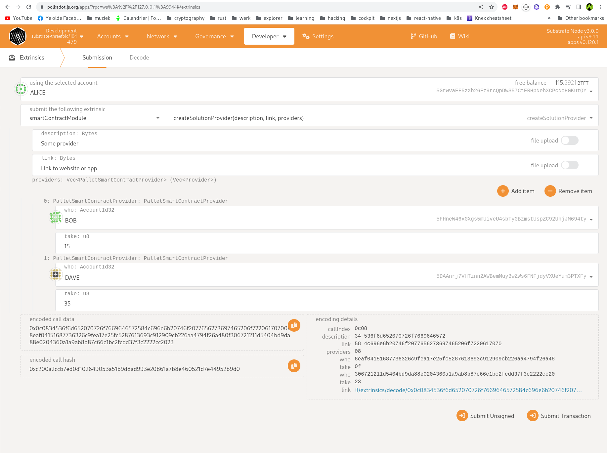
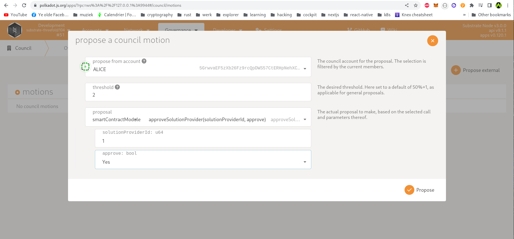
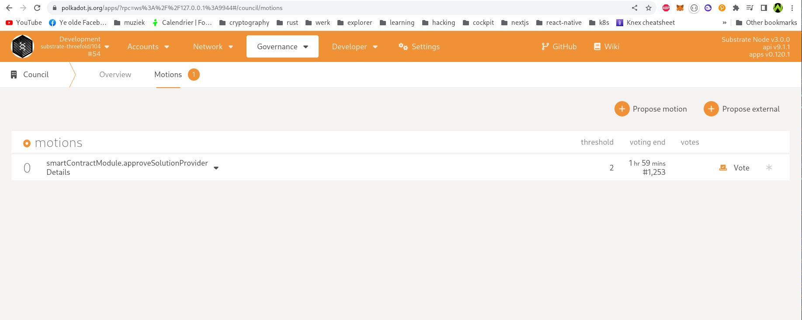
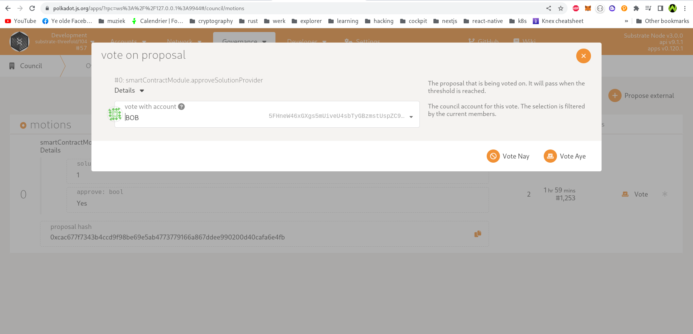
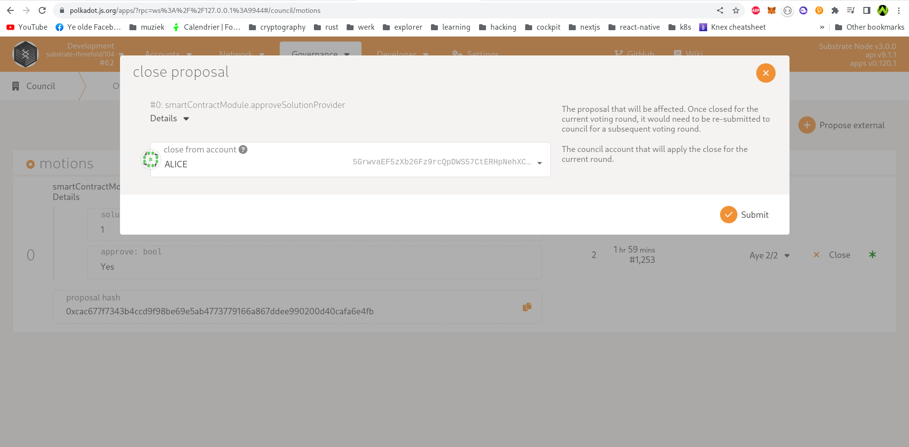
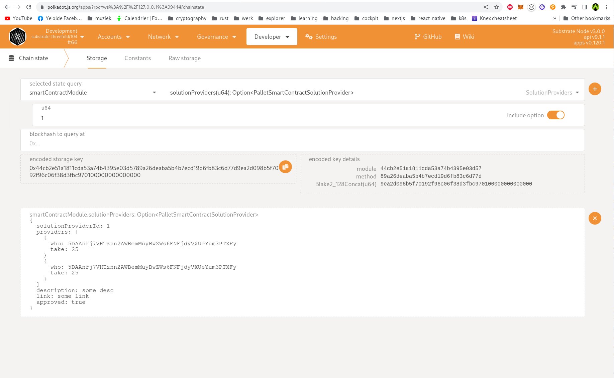
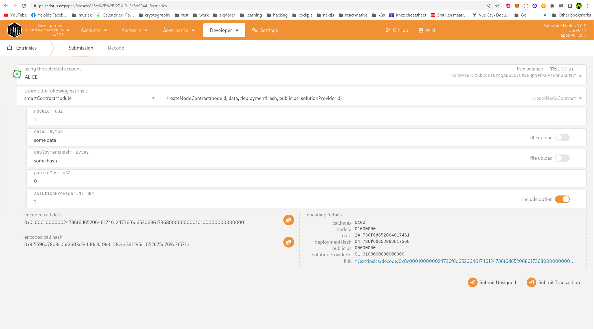

# Solution provider

A "solution" is something running on the grid, created by a community member. This can be brought forward to the council, who can vote on it to recognize it as a solution. On contract creation, a recognized solution can be referenced, in which case part of the payment goes toward the address coupled to the solution. On chain a solution looks as follows:

- Description (should be some text, limited in length. Limit should be rather low, if a longer one is desired a link can be inserted. 160 characters should be enough imo).
- Up to 5 payout addresses, each with a payout percentage. This is the percentage of the payout received by the associated address. The amount is deducted from the payout to the treasury and specified as percentage of the total contract cost. As such, the sum of these percentages can never exceed 50%. If this value is not 50%, the remainder is payed to the treasure. Example: 10% payout percentage to addr 1, 5% payout to addr 2. This means 15% goes to the 2 listed addresses combined and 35% goes to the treasury (instead of usual 50). Rest remains as is. If the cost would be 10TFT, 1TFT goes to the address1, 0.5TFT goes to address 2, 3.5TFT goes to the treasury, instead of the default 5TFT to the treasury
- A unique code. This code is used to link a solution to the contract (numeric ID).

This means contracts need to carry an optional solution code. If the code is not specified (default), the 50% goes entirely to the treasury (as is always the case today).

A solution can be created by calling the extrinsic `smartContractModule` -> `createSolutionProvider` with parameters:

- description
- link (to website)
- list of providers

Provider:

- who (account id)
- take (amount of take this account should get) specified as an integer of max 50. example: 25

A forum post should be created with the details of the created solution provider, the dao can vote to approve this or not. If the solution provider get's approved, it can be referenced on contract creation.

Note that a solution can be deleted. In this case, existing contracts should fall back to the default behavior (i.e. if code not found -> default).

### Changes to contract creation

When creating a contract, a `solution_provider_id` can be passed. An error will be returned if an invalid or non-approved solution provider id is passed.

## Creating a provider

Creating a provider is as easy as going to the [polkadotJS UI](https://polkadot.js.org/apps/?rpc=wss%3A%2F%2Ftfchain.dev.grid.tf#/extrinsics) (Currently only on devnet)

Select module `SmartContractModule` -> `createSolutionProvider(..)`

Fill in all the details, you can specify up to 5 target accounts which can have a take of the TFT generated from being a provider. Up to a total maximum of 50%. `Take` should be specified as a integer, example (`25`).

Once this object is created, a forum post should be created here: https://forum.threefold.io/

## Council needs to approve a provider before it can be used

First propose the solution to be approved:

After submission it should like like this:

Now another member of the council needs to vote:

After enough votes are reached, it can be closed:

If the close was executed without error the solution should be approved and ready to be used

Query the solution: `chainstate` -> `SmartContractModule` -> `solutionProviders`

Now the solution provider can be referenced on contract creation:

